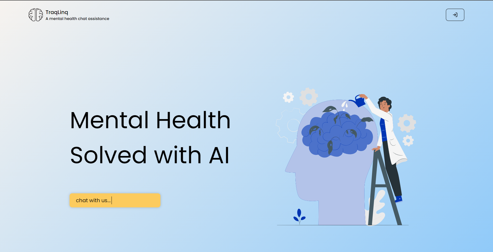
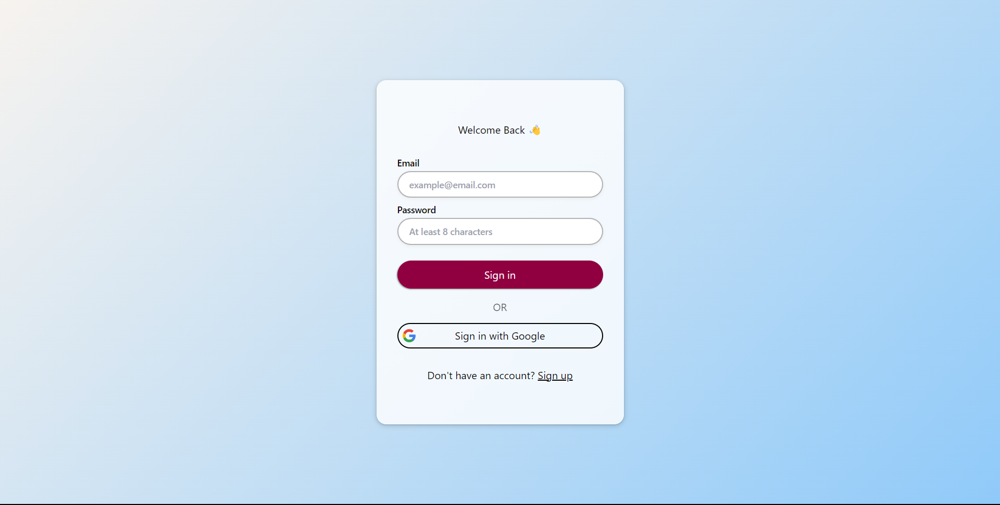

# HM0039 GPTCoders

## Develop a solution that can be used to promote mental health and well-being, providing support and resources for individuals facing mental health challenges. 

## Description
TraqLinq is a comprehensive web application designed to promote mental health and well-being by providing accessible support and resources for individuals facing mental health challenges. The project aims to address the barriers that many individuals encounter when seeking mental health support, including societal stigma, limited resources, and lack of awareness.

## Features
- Chat Bot Functionality: TraqLinq's chat bot provides users with a confidential space to express their feelings and receive emotional support through natural language interactions.

- Article Recommendations: TraqLinq recommends curated articles and resources tailored to each user's preferences, covering a variety of topics related to mental health and well-being.

- Analysis Feature: TraqLinq analyzes users' chat history to provide personalized feedback and insights, helping users gain a better understanding of their mental well-being and offering suggestions for improvement.

- Email Service: Sends emails with mental health tips and suggestions to users at regular intervals, catering to individual preferences and interactions within the platform.

## Tech Stack
- Frontend
    - React JS
    - Tailwind
- Backend
    - NodeJS
    - ExpressJS
    - Gemini(Gen AI)
    - Web Sockets
    - Node Mailer
    - Mongo DB
    - Firebase

## Screenshots

## Deployed Url
[Link to Deployed Solution](https://tranqlinq-hm0039.netlify.app/)

## Video Url
[Link to Demo Video](video_url)

## Remarks
  TraqLinq has the potential to evolve into a comprehensive platform for mental health support, continuously improving and adapting to meet the needs of its users.

